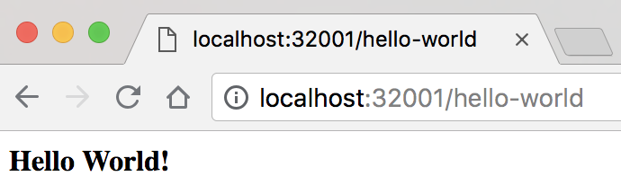

### Hello World!

To build and push https://hub.docker.com/r/gyuho/hello-world:

```bash
$ ./build-push.sh
```

To test https://hub.docker.com/r/gyuho/hello-world locally:

```bash
$ ./run-local-docker.sh
```

And run:

```bash
$ ./run-local-docker.check.sh

<<COMMENT
ENDPOINT: http://localhost:32001
<b>Hello World!</b>LIVE
{"gitCommit":"547a3d5","releaseVersion":"v0.0.1","buildTime":"2018-08-22_02:44:56","hostname":"c154009849ec"}
COMMENT
```

Or open http://localhost:32001/hello and http://localhost:32001/status:


